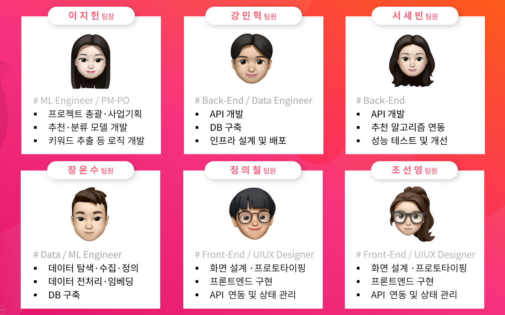
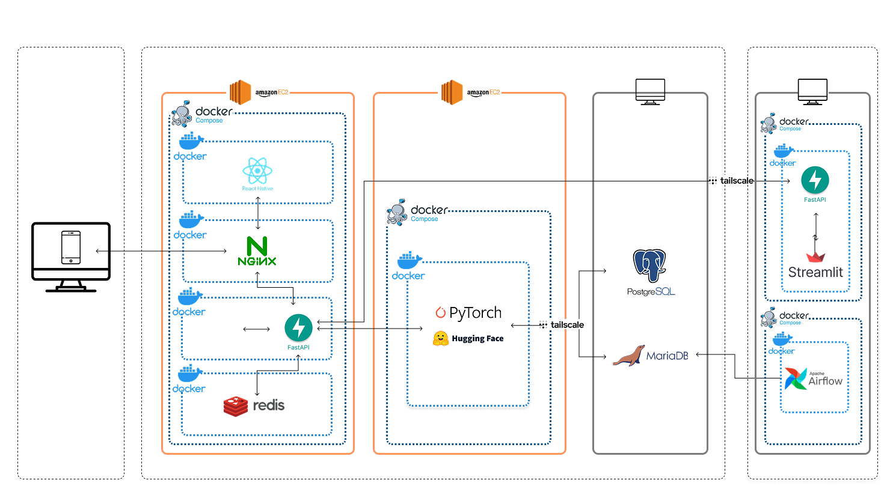
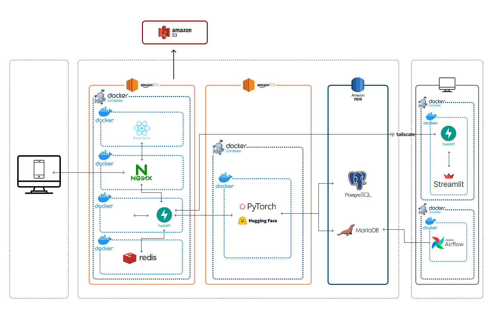
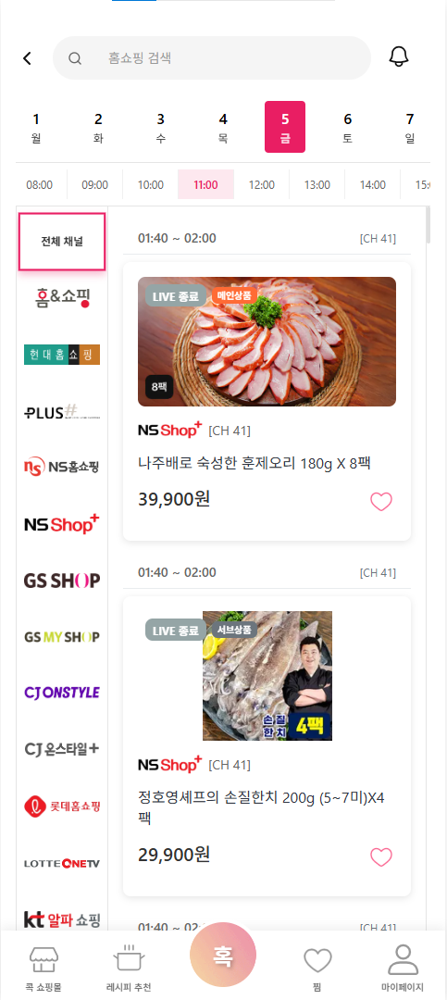
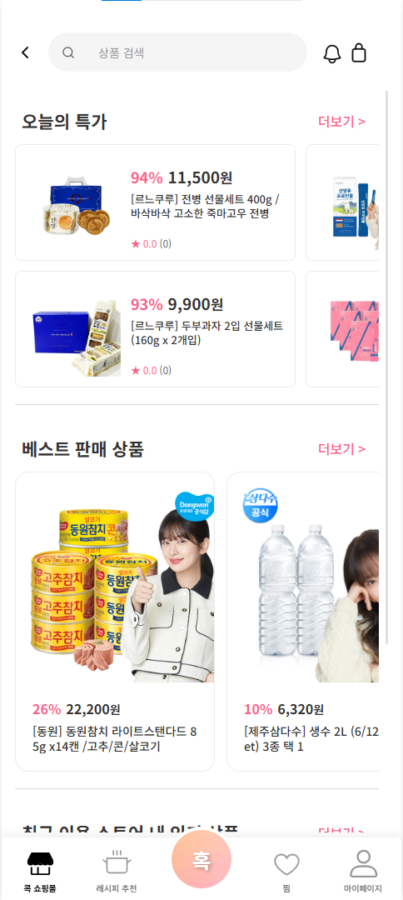

# 📌 서비스 개요
## 프로젝트명
**Eat’s 유혹**

## 프로젝트 기간
7/23 - 9/13

## 팀원 소개

## 팀 스택
### 프론트엔드
  

### 백엔드
    

### 데이터 수집
  

### 데이터베이스
   

### 분석 알고리즘
  

### 배포
  

# 시스템 아키텍쳐
## 현재

## 추후

## 프로젝트 일정(WBS)
[docs/제출 자료/02 WBS.xlsx](<docs/제출 자료/02 WBS.xlsx>)

## 필요성 (NEED)
- **고객 단절:** 홈쇼핑(40 ~ 60대)과 쇼핑몰(20 ~ 40대) 고객층 분리 → 충성 고객 단절  
- **단발성·이탈:** 첫 유입 후 단발성 소비, 재방문·반복구매 트리거 부족  
- **시장 볼륨**  
  - 홈쇼핑(2024년 2월): 매출 1조 4,558억 원 / 방송수 13,892회  
  - 카테고리 비중: 여가/생활편의 21%, 패션의류 20%, 식품 18%, 패션잡화 13%, 화장품/미용 10%, 디지털/가전 7%, 생활/건강 4%, 기타 7%  
  - 전자상거래(식품): 4,601억 달러(약 664조 원)  
- **경쟁 구도:** 쿠팡·G마켓 등 범용 채널 대비 차별화 필요  

## 제안 솔루션 (Approach)
- **식품 특화 전략:** U+TV 17개 홈쇼핑사 편성 데이터 + U+콕 쇼핑몰 데이터 연동  
- **원스텝 전환:** 실시간 방송 시청 → 즉시 구매 흐름 제공  
- **개인화 추천:**  
  - 레시피 추천 (키워드·보유 재료·구매/시청 이력 기반)  
  - 식재료 추천 (레시피 ↔ 홈쇼핑/쇼핑몰 상품 자동 매칭 + 유사/대체 상품 제안)  
- **구매 편의:** 홈쇼핑 대량 패키지 부담 ↓ + 쇼핑몰 소량/보충 구매 연결  

## 이점 (Benefit)
- **기업 측:** 매출 및 전환율 증가, 충성도 강화, 경쟁력 확보, 신규 고객 유입  
- **소비자 측:** 메뉴·구매 고민 해소, 개인화 추천 경험, 레시피–방송–구매 원스톱 연계  

## 경쟁력 (Competition)
- ‘식품’ 카테고리 초집중 + 실시간 편성 반영  
- 레시피–커머스 완전 통합 (레시피 ↔ 재료 ↔ 상품 자동 연결)  
- 알림 기반 재방문·재구매 유도  
- 개인화 추천 (찜/장바구니/시청·구매 이력 활용)  
- 광고 최소화 + 직관적 UI/UX 제공  

---

# 📌 서비스 소개

## 서비스 개념
- 홈쇼핑(U+TV)과 쇼핑몰(U+콕)을 연계한 식재료 상품 및 레시피 추천 웹 애플리케이션  
- 찜/장바구니 상품과 연계된 홈쇼핑 방송 알림, 레시피 추천, 관련 상품 구매 연결 제공  
- **슬로건:** “당신이 흥한 상품 → 관련 상품으로 유혹하겠다”  

## 핵심 기능 (Core Features)
### 홈쇼핑–쇼핑몰 연계 추천
- 홈쇼핑(U+TV) ↔ U+콕 쇼핑몰 간 유사/대체 상품 자동 매칭  
- 찜/장바구니 기반으로 방송 알림 제공
- 

### 레시피 기반 개인화 추천
- 키워드/보유 재료/시청·구매 이력 기반 맞춤형 레시피 추천  
- 레시피에서 필요한 식재료 ↔ 즉시 구매 연결 
- 
- 

### 통합 검색 기능
- 홈쇼핑 방송 상품 + U+콕 쇼핑몰 상품을 동시에 탐색  
- 시간대/카테고리/재료 필터링 가능  

### 원스텝 쇼핑 경험
- 방송 시청 → 레시피 확인 → 식재료 선택 → 즉시 구매까지 한 흐름으로 연결  

## 보조 기능 (Supporting Features)
### 방송 알림 & 푸시 알림
- 관심 품목 방송 편성 시 알림 제공  
- 재방문 및 반복 구매 유도  

### 구매 편의 기능
- 홈쇼핑 대량 패키지 부담 ↓ → 쇼핑몰에서 소량/보충 구매 연결  
- 장바구니·찜 기능 강화  

### UI/UX 최적화
- 모바일 중심 심플 UI (중장년층도 쉽게 사용)  
- 과도한 광고 최소화 → 피로도 ↓  
- 

### 데이터 기반 개인화
- 찜/장바구니/시청·구매 이력 분석  
- 맞춤형 상품 제안 및 대체품 추천  

---

# 📌 서비스 전략 및 기대효과

## 해결방안
- 홈쇼핑 ↔ 쇼핑몰 간 양방향 연계 추천  
- 장바구니/찜 내역 기반 방송 알림 제공  
- 레시피 기반 맞춤형 추천 및 필요한 재료 자동 매칭  
- 키워드 기반 통합 검색 + 모바일 친화적 UI/UX 제공  

## 기대효과
- **고객 시너지 강화:** 홈쇼핑 ↔ 쇼핑몰 교차 이용 촉진  
- **신규 고객 유입:** 레시피·맞춤형 추천 관심 소비자 확보  
- **재방문·재구매 유도:** 개인 맞춤형 알림·추천  
- **편리한 쇼핑 경험:** 레시피 ↔ 구매 원스톱 제공  
- **매출 증대:** 기존 고객 + 신규 고객 확보를 통한 매출 상승  

# 프로젝트 회고

  
<strong>장윤수</strong>

### ✅ 잘한 점
- **자동화 및 모듈화**  
   - Apache Airflow의 활용을 통해 데이터 ETL 파이프라인 자동화를 구축했고 DAG를 구성함으로 작업 순서와 병렬 처리를 도입했습니다.
   - 여러 다른 웹페이지의 데이터를 각 데이터의 형태에 맞게 수집하는 과정에서 수집하지 못하거나 잘못된 형태로 수집되는 데이터에 대해 예외 처리 코드를 작성하며 각종 데이터를 안정적으로 수집할 수 있는 크롤러를 구현했습니다. 각 프로세싱 단계에 대해 디렉토리를 나누고 이를 모듈화 했습니다.

- **작업시간 단축**  
   - 이미 수집된 제품 데이터에 대해서 수집과정을 생략함으로써 작업시간을 단축했고, 실시간 편성정보와 가격 정보 수집 역시 unique키를 활용해 데이터베이스가 무거워지지 않도록 진행했습니다.
   - 수집된 가격 정보를 직전 가격 정보와 비교하여 제품 정보 자체가 변경된 경우에만 제품 정보를 재수집하도록 처리하여 실시간 정보 변동에 대응할 수 있도록 처리했습니다.

- **정보 변경 대응**  

   - 쇼핑몰(콕) 데이터
      + 수집된 가격 정보를 직전 가격 정보와 비교하여 제품 정보 자체가 변경되거나 원가 정보가 변경된 경우에만 제품 정보를 재수집하도록 처리하여 실시간 정보 변동에 대응할 수 있도록 처리했습니다.
   - 홈쇼핑 데이터 
      + 변경되는 방영 스케쥴에 대응하기 위해 수집된 데이터를 직접 처리하지 않고 당일 편성표에 대한 별도의 테이블을 만들어 실제 방영 스케쥴과 일치하도록 처리했습니다.

### ❌ 부족한 점
- **개발 일정 관리**  
   - 데이터 관리에 대한 경험과 지식부족으로 예외 처리 작업에 많은 시간이 소요되었고, 그에 따라 최초 상정했던 ETL 구축 일정이 지연되었습니다. 이로 인해 최초 설계하였던 테이블 정의와 ERD에 변경점이 생겼으나 달라진 테이블 정의에 대한 문서화 및 공유에 대해서도 미흡한 면모를 보였습니다.

**DB 관리 미흡**  
   - ETL 구축 이후 운영 단계에서 우분투 환경 관리에 대한 경험 부족으로 DB 오류를 야기했고, 이에 대응하기 위한 시간이 소비됨으로 ETL 개발 일정이 다시 한 번 지연되었습니다.

**ODS 테이블 경량화 실패**  
   - 데이터를 수집하는 과정에서 최초 상정했던 수집 사항보다 수집 데이터가 적어지며 전처리 과정 이후 많은 데이터를 포기해야만 했습니다. 하지만 역량 부족으로 원천 데이터 크롤링 코드를 수정할 시간을 확보하지 못했고, 다소 ODS 테이블이 무거워지는 문제를 해결하지 못했습니다.

### 💡 느낀 점
- **데이터 탐색 시 선정 기준**  
   - 사람마다, 그리고 기업마다의 데이터는 각자의 관리 방식, 내재된 인사이트 등 여러 이유로 서로 다른 형태를 지니고 있습니다. 이로 인해 주제에 적합하며 전처리가 용이한 데이터를 수집하기란 결코 쉽지 않은 일이었고, 각각의 데이터를 하나의 형태로 통합하고 관리하는 것 역시 그러했습니다. 수집 데이터를 용도에 맞게 전처리하는 과정에서 한계를 느끼고 탐색과 수집 과정을 반복하며, 데이터 탐색 단계에서 수집하고 사용할 데이터를 선정할 때 사용하고 싶은 데이터가 아닌 사용할 수 있는 데이터에 조금 더 무게를 두어야 한다는 것, 아울러 이상치와 결측치에 대해서는 과감하게 대응할 수 있어야 한다는 것을 배울 수 있었습니다.

---

  
<strong>이지헌</strong>

### ✅ 잘한 점
- **추천/분류 모델 및 다양한 추천/추출 로직 개발**  
  서비스 내 전반적 부분에 걸쳐 사용되고 있는 추천, 분류 모델과 추출 로직 등 다양한 기능 개발을 성공적으로 완료하였다.  
  여러 후보 모델 및 알고리즘을 선정하여 가장 성능이 좋다고 판단되는 모델 및 알고리즘을 필요한 부분에서 적절히 사용하였다.  
  레시피 추천 기능에서도 레시피명 기반 추천, 식재료명 기반 추천, 재고 소진 레시피 추천 각각의 기능 별로 상이한 로직을 고려하고 구현하였다.  
  또한 상품명에서 식재료로 판별되는 주요 키워드를 추출하기 위해 다양한 방법을 시도하였으며, 상품명의 주요 구성을 파악하여 가중치를 부여함으로써 한계를 극복하였다.

- **도메인 지식 활용**  
  기존 보유하고 있던 *식품*에 대한 도메인 지식을 적극 활용하여 본 서비스를 기획하였다.  
  *식품* 카테고리에서 어떠한 데이터를 가지고 어떠한 기능을 구현하면 좋을지 구체적으로 구상하였다.  
  레시피 추천 기능의 결과값 확인, 식품/비식품 및 식재료/완제품 분류, 핵심 키워드 추출 등에서도 도메인 지식을 적극적으로 활용하였다.

### ❌ 부족한 점
- **키워드 입력 시 오타 대응 미흡**  
  레시피명, 재료명 입력 시 오타가 발생하였을 때의 대처를 개선하면 좋을 것 같다.  
  현재는 레시피명 입력 시 오타가 발생한 경우 유사도 기반으로 추천을 해주고 있으나, 사용자가 원하는 결과가 나오지 않을 확률이 있다.  
  추후 사용자가 입력 중인 키워드 자동완성 기능을 추가하여 오타 입력률을 감소시키는 방향으로 개선하면 좋을 것 같다.

### 💡 느낀 점
- **기획부터 구현까지 일련의 경험을 통한 성장**  
  사업 기획만 해오던 실무 경험에서 실제 개발 구현까지 해볼 수 있는 뜻 깊은 경험이었다.  
  기존에는 데이터 분석이나 모델링, 개발에 대한 지식이 없어 사업 기획 및 실무진과의 소통에서 어려움을 느끼곤 했었는데,  
  본 교육 및 서비스 개발을 통해 이 부분을 보완할 수 있게 되었으며, 본업으로 돌아가면 얻은 지식과 경험을 적극 활용할 예정이다.  
  비전공자로서 많은 걱정을 안고 시작했지만, 팀원들과 함께 협업하며 완성도 있는 결과물을 만들 수 있었다.

---

  
<strong>조선영</strong>

### ✅ 잘한 점
- **End-to-End 프로젝트 경험**  
   프로젝트의 기획 단계부터 UI/UX 설계, 요구사항 정의, WBS 작성, 프론트엔드 구현까지 전 과정을 직접 수행했습니다. 아이디어 단계에서 무형의 요구사항을 실제 동작하는 웹 서비스로 구현해낸 경험은 큰 성취였습니다.

- **요구사항 정의 → 화면 설계 → 구현의 선순환**  
   기획 단계에서 작성한 요구사항 정의서를 토대로 와이어프레임을 설계하고, 이를 곧바로 프론트엔드 코드로 옮겼습니다. 덕분에 설계와 구현이 빠르게 검증되며 프로젝트 속도를 높일 수 있었습니다.

- **사용자 중심 UI/UX 설계**  
   홈쇼핑 → 레시피 추천 → 쇼핑몰 구매까지의 핵심 플로우를 사용자 관점에서 직관적으로 이어지도록 설계했습니다. 실제 사용자가 앱 설치 없이 모바일 웹에서 바로 접근 가능하도록 설계한 점도 강점이었습니다.

- **프로젝트 관리 기초 수행**  
   WBS를 작성해 업무를 세분화하고 일정 관리에 활용했습니다. 기획부터 개발까지 한 사람이 담당하다 보니 리소스 관리가 중요했는데, WBS가 큰 도움이 되었습니다.

### ❌ 부족한 점
- **디자인 시스템 부재**  
   공통 컴포넌트/스타일 가이드 없이 화면을 설계하다 보니 일관성이 부족했습니다. 차후에는 디자인 시스템을 도입해야 합니다.

- **요구사항 변경 대응 미흡**  
   프로젝트 중간에 요구사항이 바뀌었을 때, 정의서와 화면 설계서를 즉각 업데이트하지 못해 실제 구현과 문서가 불일치한 경우가 있었습니다.

- **WBS 관리의 유연성 부족**  
   예기치 못한 성능 이슈가 발생했을 때 WBS만으로 대응하기 어려웠습니다. 단순 계획 관리에서 더 나아가 애자일 방식의 보완이 필요했습니다.

- **사용자 테스트 부족**  
   실제 사용자 피드백을 충분히 반영하지 못한 채 진행된 부분이 있어, UX 완성도가 아쉽습니다.

### 💡 느낀 점
- **End-to-End 경험의 가치**  
   처음부터 끝까지 직접 해보니, 기획–설계–구현이 따로 떨어진 게 아니라 유기적으로 연결된 과정임을 체감했습니다. 하나라도 허술하면 전체 완성도가 떨어진다는 것을 배웠습니다.

- **사용자 경험과 성능은 연결된다**  
   단순히 화면을 예쁘게 만드는 게 아니라, 빠른 로딩과 직관적인 흐름이 곧 UX라는 점을 배웠습니다.

- **문서화와 지속적 관리의 중요성**  
   요구사항 정의서, 화면 설계서는 한 번 작성하고 끝내는 게 아니라 프로젝트가 변화함에 따라 계속 업데이트해야 한다는 점을 깨달았습니다.

- **무에서 유를 만든 경험**  
   아이디어 단계에서 출발해 실제 동작하는 프로토타입 → 완성된 서비스까지 구현한 경험은 자신감을 주었고, 앞으로도 새로운 서비스를 제로부터 만들 수 있다는 확신을 얻게 되었습니다.

---

  
<strong>정의철</strong>

### ✅ 잘한 점
- **API 연결 및 통신 안정화**  
   - Axios를 활용한 체계적인 API 호출 관리.
   - JWT 토큰 자동 갱신, 401 에러 재시도 로직 구현.
   - 사용자 경험을 저해하지 않는 안정적 서비스 환경 구축.

- **결제 시스템 구현**  
   - 롱폴링 + 웹훅 기반 결제 확인 프로세스 연결.
   - 주문 상태 실시간 반영 및 시각적 피드백 제공.
   - UX 측면에서 결제 신뢰성을 높임.

- **콕 쇼핑몰 관련 페이지**  
   - 상품 조회, 장바구니, 주문 내역 등 CRUD 흐름 구현.
   - 마이페이지와 연동하여 구매 기록 및 찜한 상품 확인 가능.

- **레시피 추천 페이지**  
   - 장바구니·홈쇼핑 기반 상품 추천 기능 구현.
   - 쇼핑과 요리를 연결하는 앱의 차별화 포인트 강화.

### ❌ 부족한 점
- **에러 처리의 세밀함 부족**  
   - API 오류 메시지가 단순해 원인 파악이 어려움.
   - 운영 단계에서의 예외 대응 로직 부족.

- **결제 UX 최적화 미흡**  
   - 네트워크 끊김, 중복 결제, 강제 종료 상황 대비 부족.
   - 실사용 환경을 고려한 예외 케이스 대응 미흡.

- **레시피 추천 알고리즘 단순성**  
   - 룰 기반 추천에 그쳐 개인화 수준이 낮음.
   - 머신러닝 기반 고도화 미비.

- **UI/UX 완성도**  
   - 특정 해상도에서 레이아웃 깨짐 발생.
   - 상품 그리드 스크롤 및 카드 가독성 부족.

### 💡 느낀 점
- **프론트엔드와 백엔드의 경계 체감**  
   - 인증, 결제, 웹훅 처리에서 백엔드와 긴밀한 협업 필요성을 느낌.
   - 프론트엔드가 단순 UI 제작이 아닌 서비스 핵심 로직을 잇는 역할임을 실감.

- **사용자 경험의 중요성**  
   - 기능 구현과 실제 사용자의 만족도 간의 차이를 체감.
   - UX 완성도가 기능 완성도만큼 중요함을 깨달음.

- **협업 속도와 완성도의 균형**  
   - 빠른 구현과 일정 준수에 집중하다 보니 완성도 부족.
   - 이후 리팩토링과 우선순위 관리의 중요성을 학습.

- **개발자로서 성장 포인트 발견**  
   - 핵심 기능을 직접 구현하며 자신감 상승.
   - 동시에 예외 처리, UX 고도화 등 학습해야 할 방향성을 명확히 인지.

---

  
<strong>서세빈</strong>

### ✅ 잘한 점
- **백엔드 개발자 간의 효율적인 협업**  
   MSA 구조로 구성된 각 서비스 간 데이터 흐름과 인터페이스 설계 과정에서 초기에 공통 개발 규칙을 수립하고, 문서화 도구를 적극 활용하여 원활한 협업이 이루어졌습니다.
   중복 개발이나 충돌 없이 서비스 연동을 구현할 수 있었고, 빠른 피드백을 기반으로 전체 시스템이 유기적으로 연결되도록 조율했습니다.

- **API 명세 공유 및 연동 커뮤니케이션**  
   서비스 간 연동에 필요한 API 명세와 데이터 포맷을 빠르게 공유하고 피드백하는 과정이 잘 이뤄져, 연동 로직 구현 시 큰 장애 없이 진행됐습니다.

- **실질적인 성능 최적화 전략 적용**  
   실시간 처리 환경에 대비해 인덱스 최적화, Redis 캐싱, PostgreSQL pgvector 벡터 검색, FastAPI의 비동기 처리 등 다양한 성능 최적화 전략을 적용하며 기술적으로 성숙한 결과물을 만들었습니다.

### ❌ 개선할 점
- **프론트엔드 협업 시 명세서 설계 미흡**  
   기 API 명세 단계에서 요청 인자, 응답 구조, 예외 상황 등을 충분히 고려하지 못해, 개발 중 반복적인 수정이 발생하고 커뮤니케이션 비용이 증가했습니다.

- **다양한 사용자 시나리오와 예외 처리 고려 부족**  
   사용자 요구사항 분석이 다소 부족해, 실제 사용 흐름에 따라 발생할 수 있는 예외 케이스나 확장성 측면에서 명세서 커버리지가 아쉬웠습니다.

### 💡 느낀 점
- **API 명세의 커뮤니케이션 역할**  
   API 문서는 단순한 기술 문서가 아니라, 팀 전체의 개발 방향성과 생산성에 직결되는 중요한 협업 도구임을 실감했습니다.
   특히 사용자 중심에서 실제 어떤 데이터가 필요한지 고민하는 관점이 필수적이라는 것을 배웠습니다.

- **백엔드 협업에서의 소통의 중요성**  
   인터페이스 설계와 연동 API 정의 등에서 팀 간의 긴밀한 커뮤니케이션이 프로젝트 완성도에 직접적인 영향을 준다는 것을 경험했습니다.

- **성능 최적화와 사용자 경험 개선**  
   단순한 기능 구현을 넘어서, 응답 속도와 처리량을 개선함으로써 실제 사용자 경험에 긍정적인 영향을 줄 수 있다는 점을 체감했습니다.
   특히 실시간 추천 시스템에서 성능 최적화를 적용한 경험은 기술적 자신감을 키워준 계기가 되었습니다.

---

  
<strong>강민혁</strong>

### ✅ 잘한 점
- **MSA 구조 운영**  
   마이크로서비스 아키텍처로 역할별 서비스를 분리했습니다. 
   그 결과 장애가 생겨도 해당 모듈만 집중적으로 대응할 수 있었고, 기능 단위로 안전하게 배포할 수 있었습니다.

- **백엔드 개발자와의 협업**  
   공유 명세서와 변경 이력을 함께 관리했습니다. 이렇게 공통 기준을 맞추니 커뮤니케이션 비용이 줄고 개발·테스트 재현성이 높아졌습니다.

- **에러/문제 해결 능력 증진**
   에러가 발생했을 때, 문제를 재현한 뒤 로그와 메트릭을 대조해 원인을 좁혀가는 습관을 만들었습니다. 필요할 때는 과감히 롤백하고 패치를 적용하여 평균 복구 시간을 꾸준히 줄였습니다.

### ❌ 개선할 점
- **DB 배포**  
   현재는 VM에 DB를 띄워 배포를 했습니다. 운영 안정성을 높이기 위해 다중 가용영역과 자동 백업이 기본인 RDS로 이전할 필요가 있습니다.

- **자동화 시스템 부족**
   배포 과정에 수작업이 남아 환경별 편차가 발생했습니다. 코드 검사·테스트·이미지 빌드·보안 스캔·배포까지 연결된 CI/CD 파이프라인을 마련해야 일관성과 속도가 좋아집니다.

- **보안 관련 보완**
   서브넷 분리 수준에 머물러 시크릿 관리와 최소 권한 설계가 충분하지 못했습니다. 시크릿을 전용 저장소로 이관하고 IAM 권한을 세분화하며, WAF와 레이트 리밋 등 네트워크 보안을 더 촘촘히 적용해야 합니다.

### 💡 느낀 점
- **프론트와의 협업·공유 문서의 중요성**
   명세서와 같은 공유 파일들을 사용하여 업데이트 사항을 관리하니까 논의와 의사결정이 빨라졌습니다. 문서가 곧 개발 속도라는 사실을 다시 확인했습니다.

- **컨테이너 경계가 비용과 성능을 결정**
   ML을 분리하고 이미지 경량화와 캐시·모델 외부화를 적용하니 배포 리스크와 비용이 눈에 띄게 줄었습니다. 무엇을 컨테이너 밖으로 빼느냐가 성능과 안정성에 크게 영향을 준다는 점을 배웠습니다.

- **AWS 배포의 어려움과 중요성**
   서브넷, NAT, DNS, 방화벽을 포함한 네트워크 설계가 안정성의 핵심이라는 것을 체감했습니다. 배포 절차를 표준화하고 관측성을 갖추는 일이 운영 품질을 좌우합니다.

